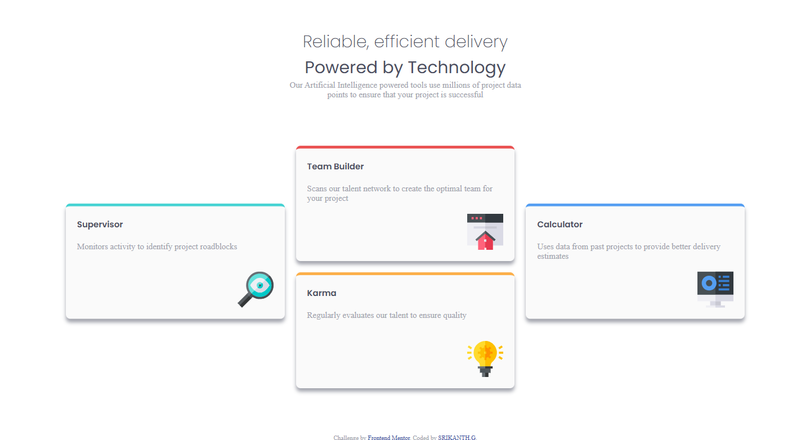
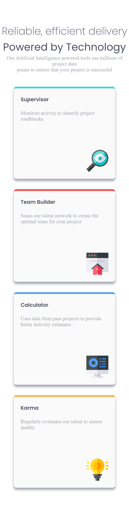

# Frontend Mentor - Four card feature section solution

This is a solution to the [Four card feature section challenge on Frontend Mentor](https://www.frontendmentor.io/challenges/four-card-feature-section-weK1eFYK). Frontend Mentor challenges help you improve your coding skills by building realistic projects. 

## Table of contents

- [Overview](#overview)
  - [The challenge](#the-challenge)
  - [Screenshot](#screenshot)
  - [Links](#links)
  - [Built with](#built-with)
  - [Useful resources](#useful-resources)
- [Author](#author)

## Overview

Task is to build a stunning, fully responsive feature section that perfectly showcases a set of key features or benefits. This is a fantastic opportunity to flex your front-end skills and practice creating clean, reusable, and professional UI components.

### The challenge

Users should be able to:

- View the optimal layout for the site depending on their device's screen size

### Screenshot

### Links

- Solution URL: [Add solution URL here](https://your-solution-url.com)
- Live Site URL: [Add live site URL here](https://your-live-site-url.com)

### Built with

- Semantic HTML5 markup
- CSS custom properties
- Flexbox

### Useful resources

- (https://css-tricks.com/snippets/css/a-guide-to-flexbox/) - This is an amazing site which helped me for in-depth understanding of flexBox. I'd recommend it to anyone.

## Author

- Frontend Mentor - [@shrikanth-dev](https://www.frontendmentor.io/profile/yourusername)
- LinkedIn - [@G Srikanth](https://www.linkedin.com/in/g-srikanth-gs)
